# Study Buddy - Database Architecture

## Overview
Study Buddy uses **Supabase (PostgreSQL)** with **Row Level Security (RLS)** for authentication and data isolation. The database has a simplified structure with 2 main tables.

---

## ERD (Entity Relationship Diagram)

```
┌─────────────────────┐
│   auth.users        │
│  (Supabase Auth)    │
├─────────────────────┤
│ id (UUID) PK        │
│ email               │
│ password_hash       │
│ created_at          │
│ updated_at          │
└──────────┬──────────┘
           │ 1 to Many
           │
           ▼
┌─────────────────────────────┐
│    public.users             │
│  (User Profiles)            │
├─────────────────────────────┤
│ id (UUID) PK, FK            │ ◄─── References auth.users
│ email                       │
│ full_name                   │
│ created_at                  │
│ updated_at                  │
└──────────┬──────────────────┘
           │ 1 to Many
           │
           ▼
┌──────────────────────────────────────────────────┐
│         public.study_sets                        │
│  (Study Sets / Question Collections)             │
├──────────────────────────────────────────────────┤
│ id (TEXT) PK                                     │
│ user_id (UUID) FK ──────────────────────┐       │
│ title (TEXT) - Set name                 │       │
│ description (TEXT) - Optional desc      │       │
│ terms (JSONB) - Array of term objects   │       │
│ questions (JSONB) - Array of questions  │       │
│ created_at (TIMESTAMP)                  │       │
│ updated_at (TIMESTAMP)                  │       │
└──────────────────────────────────────────────────┘
```

### Mermaid ERD Code

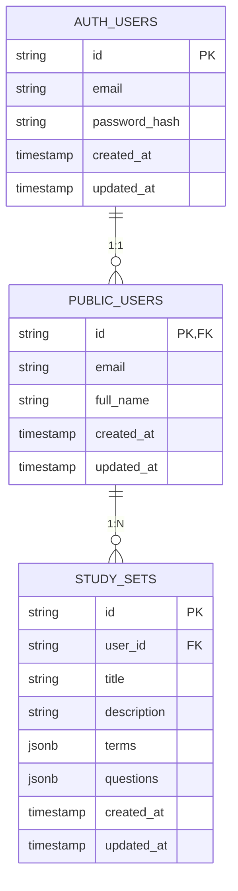

---

## Additional Mermaid Diagrams

### Table Relationships Graph

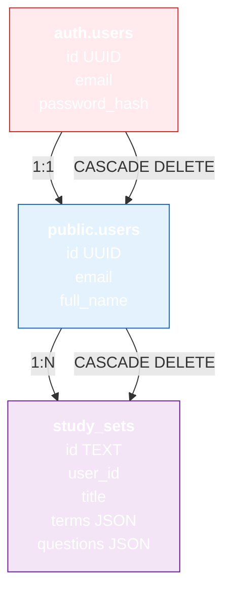

### User Registration Sequence

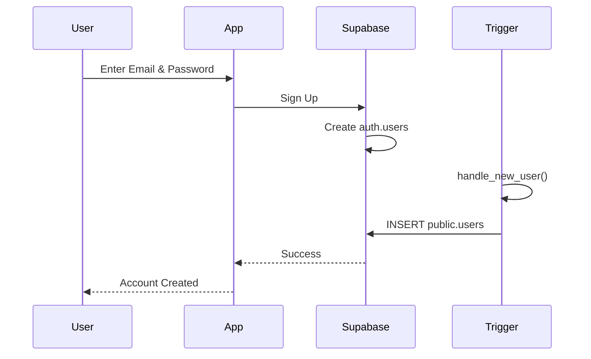

### Study Set Creation Sequence

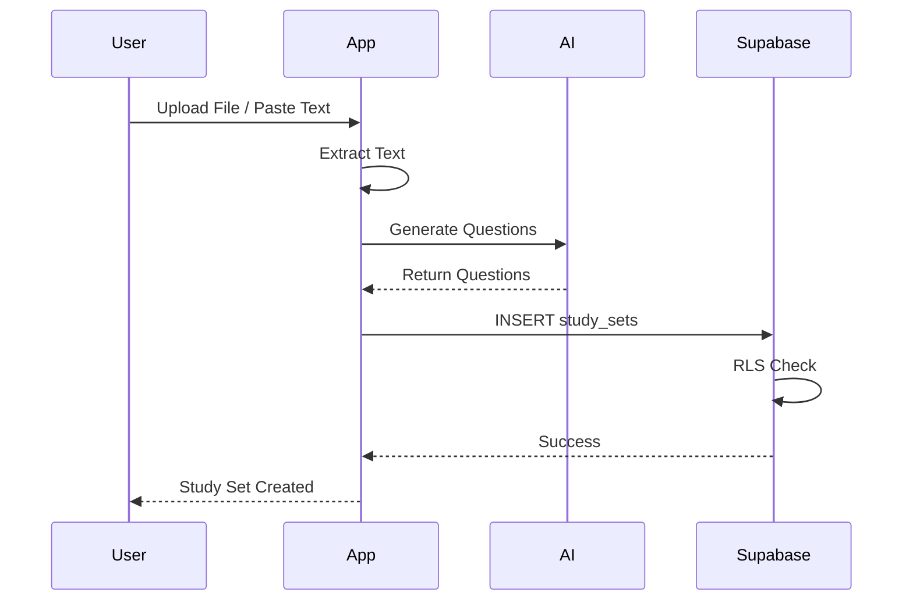

### Data Access Control via RLS

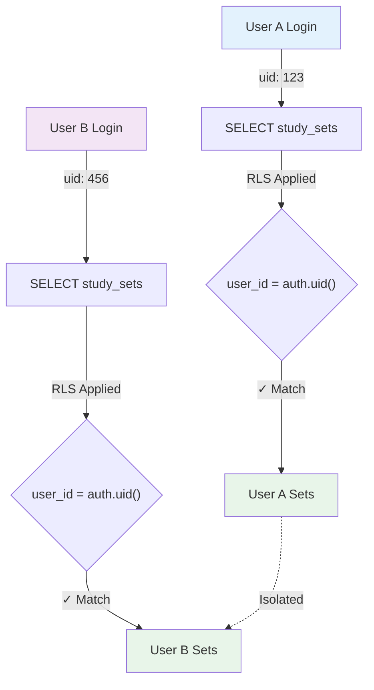

---

## Table Structure

### 1. **auth.users** (Supabase Auth - Auto-managed)
Managed by Supabase authentication system. Stores authentication credentials.

```sql
CREATE TABLE auth.users (
  id UUID PRIMARY KEY,
  email TEXT UNIQUE NOT NULL,
  password_hash TEXT,
  created_at TIMESTAMP DEFAULT now(),
  updated_at TIMESTAMP DEFAULT now()
);
```

---

### 2. **public.users** (User Profiles)
Extends auth.users with additional profile information.

```sql
CREATE TABLE IF NOT EXISTS public.users (
  id UUID PRIMARY KEY REFERENCES auth.users(id) ON DELETE CASCADE,
  email TEXT UNIQUE NOT NULL,
  full_name TEXT,
  created_at TIMESTAMP DEFAULT now(),
  updated_at TIMESTAMP DEFAULT now()
);
```

**Purpose:**
- Store user profile information
- One record per authenticated user
- Automatically created via trigger when user signs up

**Relationships:**
- `id` → FK to `auth.users(id)` (cascade delete)

---

### 3. **public.study_sets** (Study Materials)
Stores all study sets (collections of questions/terms) for each user.

```sql
CREATE TABLE study_sets (
  id TEXT PRIMARY KEY,
  user_id UUID NOT NULL REFERENCES auth.users(id) ON DELETE CASCADE,
  title TEXT NOT NULL,
  description TEXT,
  terms JSONB DEFAULT '[]'::jsonb,
  questions JSONB DEFAULT '[]'::jsonb,
  created_at TIMESTAMP DEFAULT NOW(),
  updated_at TIMESTAMP DEFAULT NOW()
);

CREATE INDEX idx_study_sets_user_id ON study_sets(user_id);
```

**Columns:**
- `id` - Unique identifier (UUID v4 as string)
- `user_id` - FK to user who owns this set
- `title` - Set name (e.g., "Biology Chapter 5")
- `description` - Optional description
- `terms` - JSON array of flashcard terms
- `questions` - JSON array of quiz questions
- `created_at` - Timestamp of creation
- `updated_at` - Timestamp of last modification

**Relationships:**
- `user_id` → FK to `public.users(id)` (cascade delete)

---

## JSON Structure Examples

### Study Set Record
```json
{
  "id": "550e8400-e29b-41d4-a716-446655440000",
  "user_id": "123e4567-e89b-12d3-a456-426614174000",
  "title": "Spanish Vocabulary",
  "description": "Common Spanish words for beginners",
  "terms": [
    {
      "id": "term-1",
      "term": "Hola",
      "definition": "Hello"
    },
    {
      "id": "term-2",
      "term": "Adiós",
      "definition": "Goodbye"
    }
  ],
  "questions": [
    {
      "id": "q-1",
      "type": "multiple_choice",
      "question": "What does 'Hola' mean?",
      "options": ["Hello", "Goodbye", "Thank you", "Please"],
      "correctIndex": 0
    },
    {
      "id": "q-2",
      "type": "true_false",
      "question": "Adiós means Hello",
      "correctAnswer": false
    }
  ],
  "created_at": "2024-05-13T10:30:00Z",
  "updated_at": "2024-05-13T15:45:00Z"
}
```

---

## Row Level Security (RLS)

### Policies Overview

**users table:**
```sql
-- Users can only view their own profile
CREATE POLICY "Users can view their own profile"
  ON public.users FOR SELECT
  USING (auth.uid() = id);

-- Users can only update their own profile
CREATE POLICY "Users can update their own profile"
  ON public.users FOR UPDATE
  USING (auth.uid() = id);
```

**study_sets table:**
```sql
-- Users can only view their own study sets
CREATE POLICY "Users can view their own study sets"
  ON public.study_sets FOR SELECT
  USING (auth.uid() = user_id);

-- Users can only create sets for themselves
CREATE POLICY "Users can create study sets"
  ON public.study_sets FOR INSERT
  WITH CHECK (auth.uid() = user_id);

-- Users can only update their own study sets
CREATE POLICY "Users can update their own study sets"
  ON public.study_sets FOR UPDATE
  USING (auth.uid() = user_id);

-- Users can only delete their own study sets
CREATE POLICY "Users can delete their own study sets"
  ON public.study_sets FOR DELETE
  USING (auth.uid() = user_id);
```

**Security Guarantee:** Users can NEVER access or modify other users' data, even with crafted API calls.

---

## Data Flow

### User Registration Flow

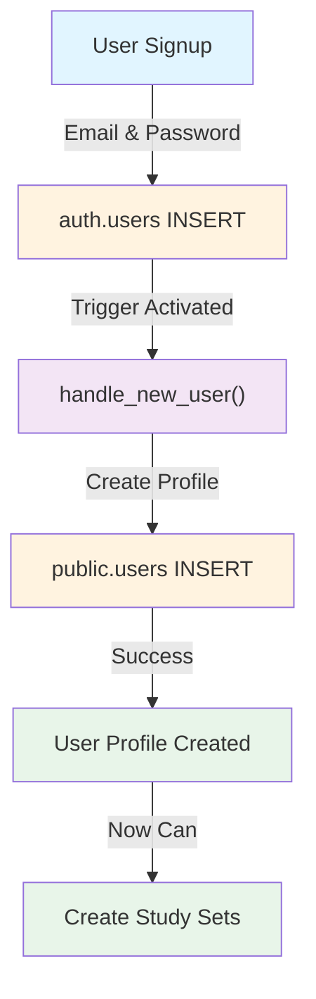

### Create Study Set Flow

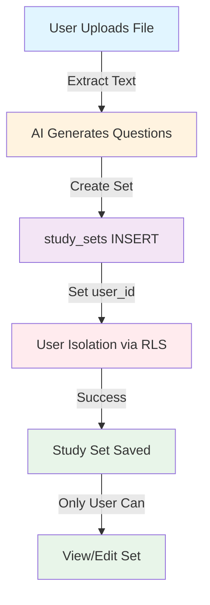

### Retrieve Study Sets Flow

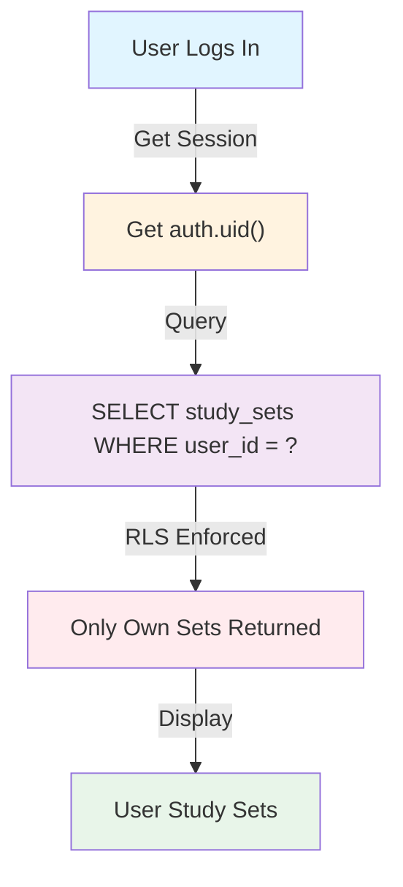

---

## Indexes

```sql
-- Fast lookups of all sets for a user
CREATE INDEX idx_study_sets_user_id ON study_sets(user_id);
```

**Purpose:** When user logs in, we quickly find all their study sets without full table scan.

---

## Storage Strategy

### Local Storage (React Native)
- Uses `AsyncStorage` for offline-first capability
- Study sets cached locally
- Syncs to Supabase when online

### Cloud Storage (Supabase)
- Single source of truth
- Real-time sync across devices
- Automatic backups

---

## Scalability Considerations

1. **JSONB for Flexibility**
   - Terms and questions stored as JSON arrays
   - Easy to add new question types without schema migration
   - Allows dynamic content structure

2. **User Isolation via RLS**
   - Each user is completely isolated
   - Can safely add more users without performance impact
   - No application-level checks needed

3. **Indexing Strategy**
   - Indexed on `user_id` for fast queries
   - No need for study set ID index (PK already indexed)

---

## Summary

| Component | Purpose | Type |
|-----------|---------|------|
| auth.users | Authentication | Supabase managed |
| public.users | User profiles | Main table |
| study_sets | Study materials | Main table |
| RLS Policies | Data isolation | Security |
| JSONB columns | Flexible content | Data storage |

**Total Tables:** 2 main tables (auth.users is managed by Supabase)  
**Total Indexes:** 1 (user_id on study_sets)  
**Security Model:** Row Level Security (RLS) with user isolation  
**Scalability:** Supports unlimited users, each with unlimited study sets

---

## Complete Mermaid Diagram Reference

### Study Set Structure Diagram

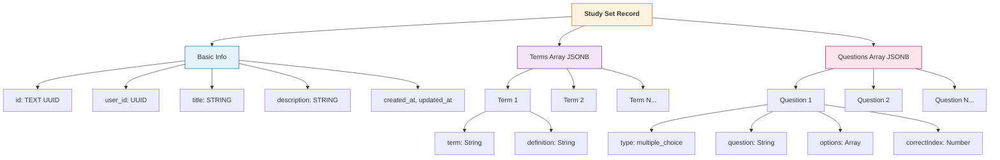

### Complete Database Flow

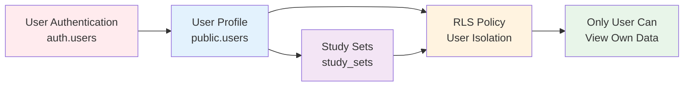

### API Operation Flow

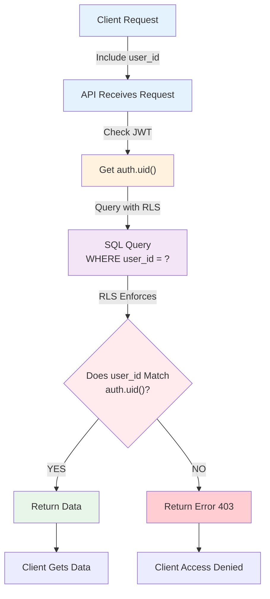

### Index Strategy

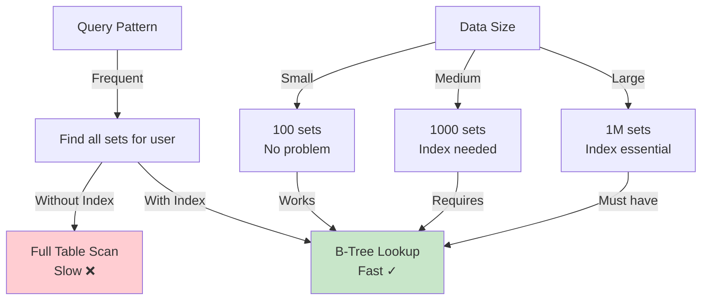

