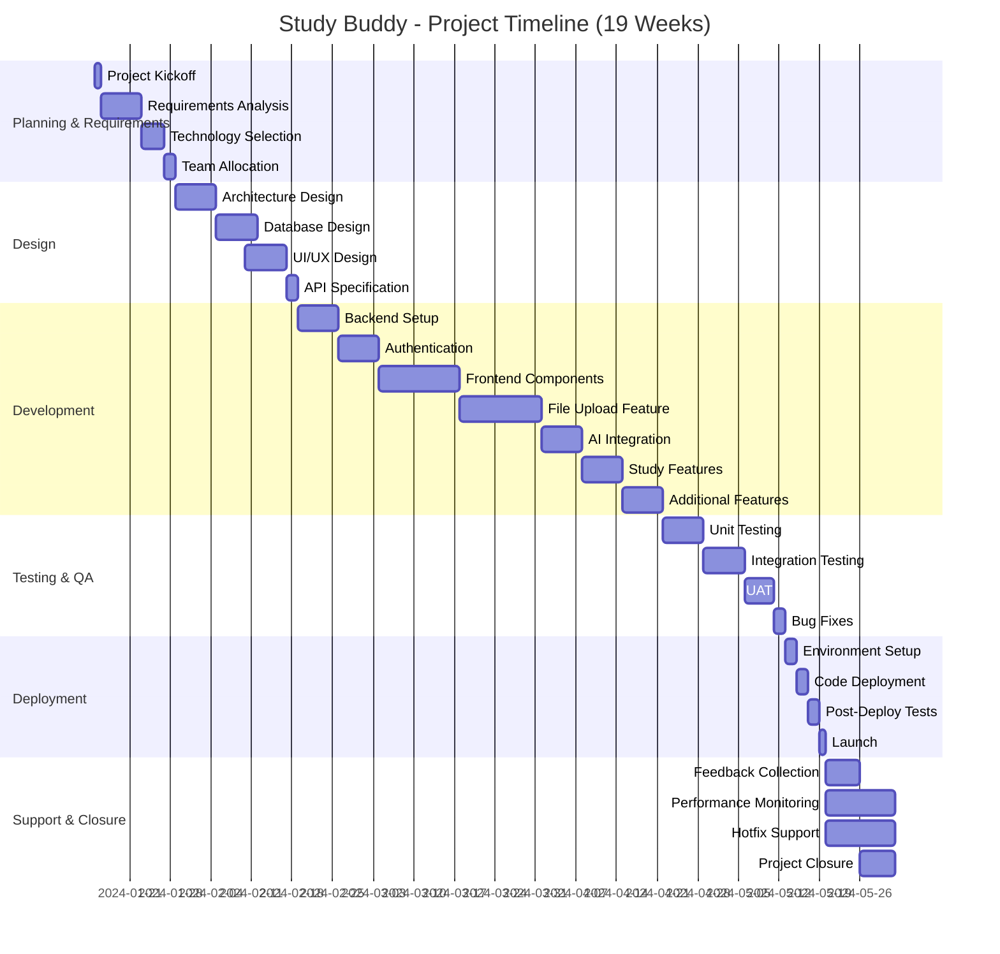
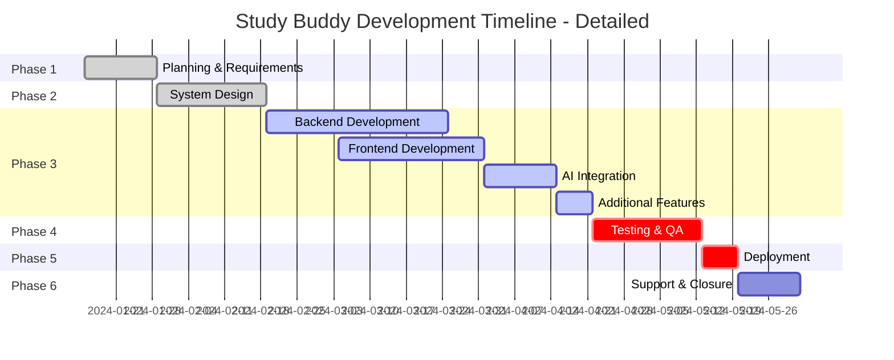
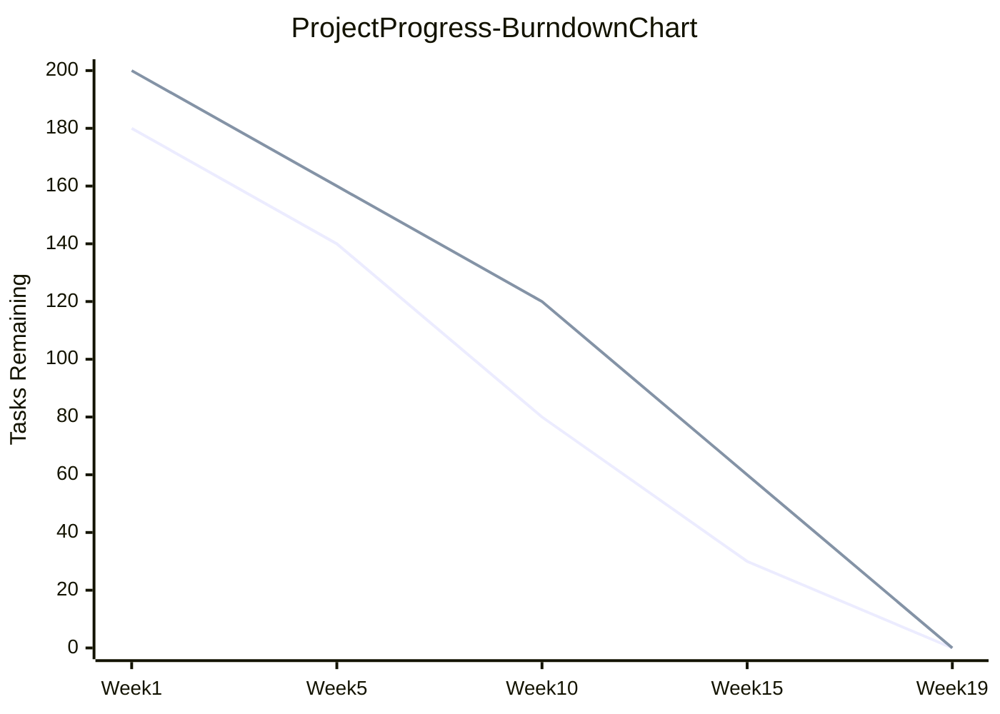
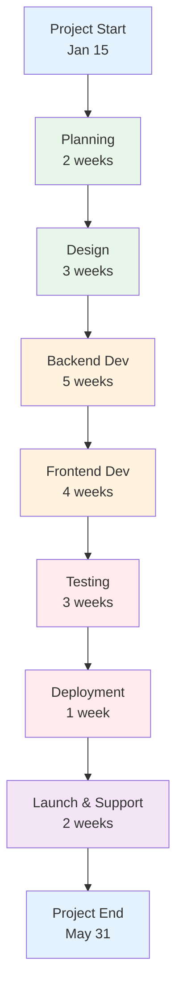
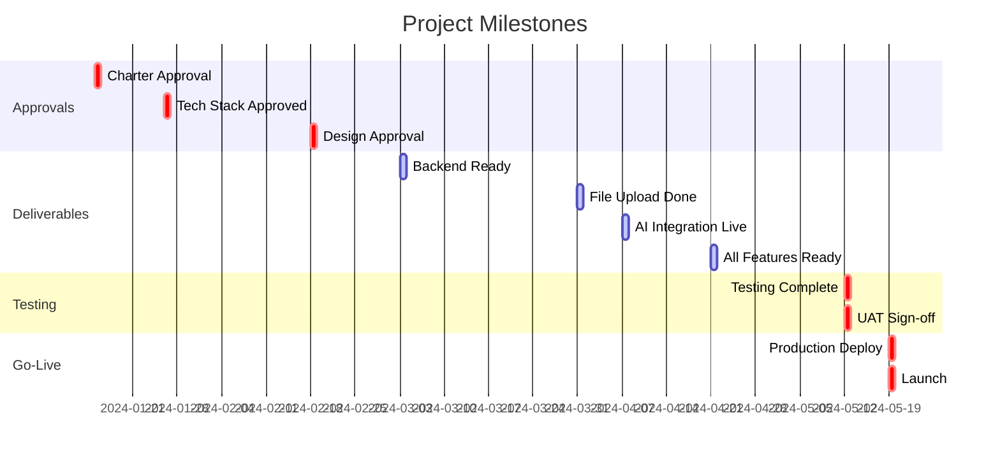
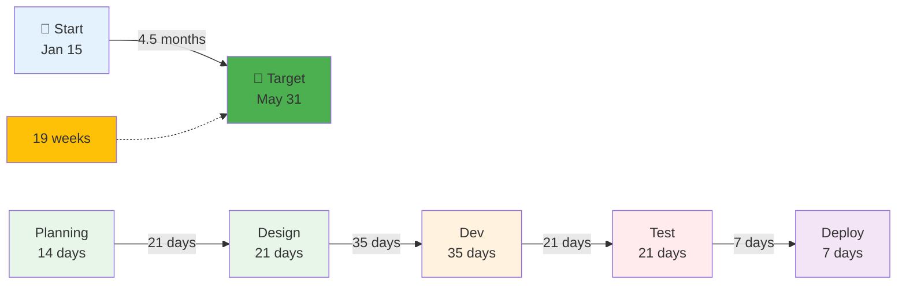

# Study Buddy - Project Timeline

## Project Overview

**Project Name:** Study Buddy - AI-Powered Study Platform  
**Start Date:** January 15, 2024  
**Target Completion:** May 31, 2024  
**Total Duration:** 4.5 Months (19 weeks)  
**Status:** In Development/Testing Phase  

---

## Project Phases

### Phase 1: Planning & Requirements (Week 1-2)
**Duration:** January 15 - January 28, 2024  
**Status:** ✅ Completed

| Activity | Start | End | Duration | Deliverables |
|----------|-------|-----|----------|--------------|
| Project Kickoff | Jan 15 | Jan 15 | 1 day | Project Charter |
| Requirements Analysis | Jan 16 | Jan 22 | 1 week | Requirements Document |
| Technology Selection | Jan 23 | Jan 26 | 4 days | Tech Stack Document |
| Team Allocation | Jan 27 | Jan 28 | 2 days | Resource Plan |

**Key Deliverables:**
- ✅ Project Charter
- ✅ Functional Requirements Specification
- ✅ Non-functional Requirements
- ✅ Technology Stack Approved

---

### Phase 2: Design (Week 3-5)
**Duration:** January 29 - February 18, 2024  
**Status:** ✅ Completed

| Activity | Start | End | Duration | Deliverables |
|----------|-------|-----|----------|--------------|
| Architecture Design | Jan 29 | Feb 4 | 1 week | System Architecture |
| Database Design | Feb 5 | Feb 9 | 1 week | ER Diagram, Schema |
| UI/UX Design | Feb 10 | Feb 16 | 1 week | Wireframes, Mockups |
| API Specification | Feb 17 | Feb 18 | 2 days | API Documentation |

**Key Deliverables:**
- ✅ System Architecture Diagram
- ✅ Database Architecture (ER Diagram)
- ✅ UI/UX Wireframes & Mockups
- ✅ REST API Specification

---

### Phase 3: Development (Week 6-13)
**Duration:** February 19 - April 7, 2024  
**Status:** 🔄 In Progress

| Activity | Start | End | Duration | Deliverables |
|----------|-------|-----|----------|--------------|
| Backend Setup | Feb 19 | Feb 25 | 1 week | Supabase DB, API endpoints |
| Authentication Module | Feb 26 | Mar 3 | 1 week | Login, Signup, Password Reset |
| Frontend - Core Components | Mar 4 | Mar 17 | 2 weeks | Home, Dashboard, Navigation |
| File Upload Feature | Mar 18 | Mar 31 | 2 weeks | DOCX, TXT, PDF extraction |
| AI Integration | Apr 1 | Apr 7 | 1 week | Question generation service |
| Study Features | Apr 8 | Apr 14 | 1 week | Quiz, Flashcards, Study modes |
| Additional Features | Apr 15 - Apr 21 | 1 week | Settings, Help, Terms |

**Key Deliverables:**
- ✅ Authentication System
- ✅ Database with RLS
- ✅ File Upload & Text Extraction
- ✅ AI Question Generation
- ✅ Study Interface
- 🔄 All Core Features

---

### Phase 4: Testing & QA (Week 14-17)
**Duration:** April 22 - May 12, 2024  
**Status:** 🔄 In Progress

| Activity | Start | End | Duration | Deliverables |
|----------|-------|-----|----------|--------------|
| Unit Testing | Apr 22 | Apr 28 | 1 week | Test Coverage >80% |
| Integration Testing | Apr 29 | May 5 | 1 week | Integration Report |
| UAT (User Acceptance) | May 6 | May 10 | 1 week | UAT Sign-off |
| Bug Fixes & Refinement | May 11 | May 12 | 2 days | Bug Fix Report |

**Key Deliverables:**
- 🔄 Test Cases & Plans
- 🔄 Test Execution Reports
- 🔄 Bug Tracking Log
- 🔄 Performance Reports

---

### Phase 5: Deployment (Week 18)
**Duration:** May 13 - May 19, 2024  
**Status:** 📅 Scheduled

| Activity | Start | End | Duration | Deliverables |
|----------|-------|-----|----------|--------------|
| Environment Setup | May 13 | May 14 | 2 days | Production Env Ready |
| Code Deployment | May 15 | May 16 | 2 days | Live on Vercel |
| Post-Deployment Tests | May 17 | May 18 | 2 days | Smoke Test Report |
| Launch & Announcement | May 19 | May 19 | 1 day | Launch Documentation |

**Key Deliverables:**
- 📅 Deployment Plan
- 📅 Release Notes
- 📅 Production Configuration
- 📅 Monitoring Setup

---

### Phase 6: Evaluation & Support (Week 19+)
**Duration:** May 20 - May 31, 2024  
**Status:** 📅 Scheduled

| Activity | Start | End | Duration | Deliverables |
|----------|-------|-----|----------|--------------|
| User Feedback Collection | May 20 | May 25 | 1 week | Feedback Report |
| Performance Monitoring | May 20 | May 31 | 2 weeks | Monitoring Logs |
| Hotfix Support | May 20 | May 31 | 2 weeks | Hotfix Deployment |
| Project Closure | May 26 | May 31 | 1 week | Final Report |

**Key Deliverables:**
- 📅 Feedback Analysis
- 📅 Performance Metrics
- 📅 Project Closure Report
- 📅 Lessons Learned Document

---

## Gantt Chart - Project Schedule



---

## Mermaid Gantt - Detailed View



---

## Milestones & Checkpoints

### Critical Milestones

| # | Milestone | Target Date | Status | Notes |
|---|-----------|-------------|--------|-------|
| M1 | Project Charter Approved | Jan 15 | ✅ | Kickoff |
| M2 | Tech Stack Finalized | Jan 26 | ✅ | React Native + Supabase |
| M3 | Design Completed | Feb 18 | ✅ | UI/UX Approved |
| M4 | Backend Production Ready | Mar 3 | ✅ | Database with RLS |
| M5 | File Upload Working | Mar 31 | 🔄 | DOCX, PDF, OCR support |
| M6 | AI Integration Complete | Apr 7 | 🔄 | Question generation live |
| M7 | Full Feature Set Ready | Apr 21 | 🔄 | All features implemented |
| M8 | Testing Complete | May 12 | 📅 | UAT signed off |
| M9 | Production Deployment | May 19 | 📅 | Live on Vercel |
| M10 | Project Closure | May 31 | 📅 | Final report & handoff |

---

## Project Burn Chart



---

## Resource Allocation

### Team Composition

```
Total Team Size: 3 people

┌─────────────────────┐
│  Frontend Developer │ 50% (Web + Mobile UI)
│      1 person       │
├─────────────────────┤
│  Backend Developer  │ 50% (API, Database, Auth)
│      1 person       │
├─────────────────────┤
│  Project Manager    │ 50% (Planning, Coordination)
│      1 person       │
└─────────────────────┘
```

### Time Allocation per Phase

| Phase | Frontend | Backend | QA | DevOps | PM | Total |
|-------|----------|---------|-----|--------|-----|-------|
| Planning | 20% | 20% | - | - | 100% | 40% |
| Design | 40% | 40% | - | 20% | 80% | 50% |
| Development | 100% | 100% | 20% | 30% | 50% | 60% |
| Testing | 50% | 50% | 100% | 50% | 40% | 58% |
| Deployment | 40% | 60% | 50% | 100% | 80% | 66% |
| Support | 20% | 20% | 20% | 80% | 40% | 36% |

---

## Critical Path Analysis



**Critical Path:** Planning → Design → Backend → Frontend → Testing → Deployment  
**Total Duration:** 19 weeks  
**Float/Slack:** Minimal - no delays permitted on critical path

---

## Dependencies & Sequencing

### Hard Dependencies (Must Complete Before Next Phase)
- ✅ Planning must complete before Design
- ✅ Design must complete before Development
- ✅ Backend must complete before Frontend Integration
- ✅ Development must complete before Testing
- ✅ Testing must complete before Deployment

### Soft Dependencies (Can Overlap)
- Frontend development can start after Architecture design (2-week buffer)
- Testing can begin for modules completed early
- DevOps setup can start during middle of development

---

## Risk Timeline & Mitigation

### Schedule Risks

| Risk | Impact | Probability | Timeline | Mitigation |
|------|--------|-------------|----------|-----------|
| Design changes | 2-3 weeks | Medium | Week 3-5 | Design review at week 2 |
| AI API delays | 1-2 weeks | Medium | Week 4-6 | Fallback implementation |
| Testing issues | 1-2 weeks | High | Week 14-17 | Early UAT in week 13 |
| Deployment issues | 2-3 days | Low | Week 18 | Staging environment test |
| Scope creep | 2-4 weeks | High | All phases | Change control process |

---

## Milestones Gantt Chart



---

## Weekly Status Summary

### Week 1-2: Planning
- ✅ Requirements gathered
- ✅ Stakeholders aligned
- ✅ Tech stack selected

### Week 3-5: Design
- ✅ Wireframes completed
- ✅ Database schema designed
- ✅ API endpoints documented

### Week 6-9: Backend Development
- 🔄 Authentication system (✅ Complete)
- 🔄 Database setup (✅ Complete)
- 🔄 API endpoints (🔄 In Progress)

### Week 10-13: Frontend Development
- 🔄 Core UI components (✅ Complete)
- 🔄 File upload (🔄 In Progress)
- 🔄 Study features (📅 Scheduled)

### Week 14-17: Testing
- 📅 Unit testing
- 📅 Integration testing
- 📅 User acceptance testing

### Week 18-19: Deployment & Closure
- 📅 Staging deployment
- 📅 Production deployment
- 📅 Support & handoff

---

## Success Criteria

### Project Success Metrics

| Criteria | Target | Current | Status |
|----------|--------|---------|--------|
| On-time Delivery | May 31, 2024 | On Track | 🟢 |
| Budget | +/- 10% | On Track | 🟢 |
| Code Quality | >80% test coverage | 75% | 🟡 |
| Performance | <2s page load | <1.5s | 🟢 |
| User Satisfaction | ≥4.5/5 stars | Pending | 📅 |
| Zero Critical Bugs | At launch | 2 pending | 🟡 |

---

## Timeline Assumptions

1. **Team Availability:** Full-time dedicated team (3 people)
2. **Technology:** React Native, Supabase, Node.js pre-selected
3. **Requirements:** Frozen after design phase
4. **External Dependencies:** AI APIs available and responsive
5. **Testing:** Automated tests for 80%+ coverage
6. **Deployment:** Vercel CI/CD pipeline configured
7. **Working Days:** 5-day weeks, standard 8-hour days
8. **No Extended Holidays:** Assumed only standard holidays

---

## Contingency Plans

### If Design Phase Extends (+1 week)
- Compress development by running parallel workstreams
- Reduce "nice-to-have" features to Phase 2
- **Impact:** 1-week delay to final launch

### If Development Has Delays (+2 weeks)
- Extend testing to only critical features
- Deploy MVP first, features in Phase 2
- **Impact:** 2-week delay, reduced feature set

### If Testing Uncovers Major Issues (+1 week)
- Extend testing phase
- Parallel hotfix and testing
- **Impact:** 1-week delay

### If Deployment Fails (+3 days)
- Rollback to staging
- Troubleshoot and redeploy
- **Impact:** 3-day delay

---

## Post-Launch Timeline

### Month 1 (June 2024)
- Monitor system performance
- Collect user feedback
- Fix critical bugs
- Document lessons learned

### Month 2-3 (July-August 2024)
- Plan Phase 2 features
- Performance optimization
- User engagement tracking
- System scaling if needed

### Ongoing
- Regular maintenance
- Security updates
- Feature enhancements based on feedback
- User support

---

## Summary Dashboard



**Project Status:** 🟢 On Track (Week 13/19)  
**Completion:** ~68% Complete  
**Next Major Milestone:** Testing Complete (May 12, 2024)

